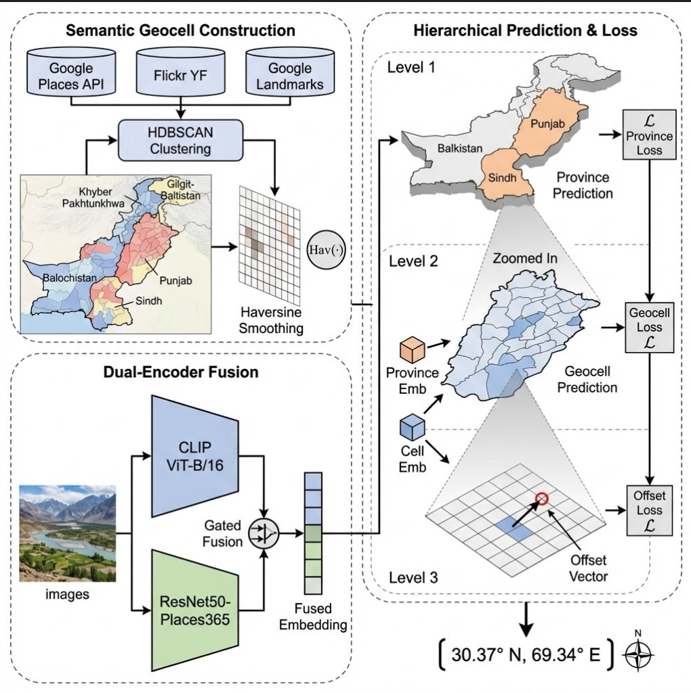

# 🇵🇰 GEOPAK: A Province Aware Hierarchical Geolocation Framework for Vision Based Localization in Pakistan

GEOPAK is a specialized geographic vision model designed to estimate the precise location (latitude, longitude) of images taken within Pakistan. Unlike global models, GEOPAK handles the specific visual diversity of Pakistan's provinces from the coastal lines of Sindh to the mountainous terrains of Gilgit-Baltistan by leveraging a novel dual-encoder architecture and a province aware geocell classification system.

## 🧠 Model Architecture

GEOPAK uses a **Dual-Encoder Gated Fusion** architecture to combine general object recognition with scene-specific features.

### Model Architecture Diagram


### Component Pipeline & Embeddings
1.  **Dual Input Encoders**:
    *   **CLIP ViT-B/16**: Semantic encoder (Frozen) capturing high-level concepts (e.g., "mosque", "mountain").
    *   **ResNet50-Places365**: Scene encoder capturing environmental context (e.g., "urban canyon", "glacier").
2.  **Gated Fusion Mechanism**:
    *   Features from both encoders are projected to 512-dim and fused via a learnable gate that weighs the importance of semantic vs. scene features per image.
3.  **Hierarchical Classification Heads**:
    *   **Province Head**: Predicts one of 7 provinces using the fused features.
    *   **Province-Gated Geocell Heads**: A Mixture-of-Experts style block where the appropriate head (e.g., Sindh Head) is activated based on the province prediction.
    *   **Embeddings**: To Condition the Offset Head, we use learnable embedding layers:
        *   **Province Embedding**: ($7 \times 32$ dim)
        *   **Cell Embedding**: ($N_{\text{cells}} \times 96$ dim)
        *   These embeddings are concatenated with the visual features to inform the offset head about the "coarse" location it is refining.
4.  **Critical Precision Head (Offset)**:
    *   A regression head that predicts small $\Delta lat, \Delta lon$ adjustments. It inputs the fused visual vector + Cell Embedding + Province Embedding.
5.  **Auxiliary Coarse Head**:
    *   A secondary regression head connected directly to the fusion layer. It is used only during training to force the encoders to retain global coordinate information (`lat, lon`) early in the network, stabilizing the training of the specific heads.

---

## 📊 Dataset

The dataset is constructed specifically for Pakistan using a targeted regional crawler.

### Data Acquisition & Processing
The dataset is a curated collection of geographically diverse images constructed from multiple high-quality sources, specifically targeted to capture the visual variance of Pakistan's landscape.

*   **Data Sources**:
    1.  **Google Places API**: High-resolution images of verifyable landmarks, urban centers, and points of interest.
    2.  **YF (Yahoo Flickr Creative Commons)**: A massive dataset of user-uploaded geotagged imagery providing diverse, in-the-wild perspectives.
    3.  **Google Landmarks v2**: A large-scale benchmark dataset for instance-level recognition and retrieval.
    4.  **FlickApi**: Integrated crawler specifically for fetching high-resolution, relevant regional imagery from Flickr's API.

*   **Processing Pipeline**:
    1.  **Crawl & Aggregate**: Raw images and metadata are aggregated from the source APIs using regional bounding boxes.
    2.  **Quality Filtration**: Images are filtered to remove low-quality samples, non-geotagged entries, and indoor scenes irrelevant to geographic localization.
    3.  **Geocell Construction (Clustering)**:
        *   **Algorithm**: **HDBSCAN** (Hierarchical Density-Based Spatial Clustering) is used to cluster raw GPS coordinates. Unlike K-Means, it adapts to density variations (dense in Lahore, sparse in Thar).
        *   **Dynamic Balancing**: We target a specific number of cells per province based on area and data density.
        *   **Radius Constraints**: Clusters are constrained to a physically meaningful radius (e.g., max 50km for rural, 5km for urban) to ensure that knowing the "Cell ID" gives a strong location prior.

### Dataset Stats & Imbalance
The dataset contains a total of **90,515** images (81,462 Train, 9,053 Test). It reflects the natural imbalance of digital data availability in Pakistan.

| Region | Samples | Density | Challenge |
| :--- | :--- | :--- | :--- |
| **Sindh** | 65,221 | Very High | High urban density (Karachi), strong coastal features. |
| **Punjab** | 8,459 | Medium-High | Dense urban usage, agricultural patterns. |
| **KPK** | 5,344 | Medium | Variegated terrain, moderate density. |
| **Islamabad (ICT)** | 4,410 | High (Local) | Very high density for small area. |
| **Balochistan** | 3,627 | Low | **Extreme sparsity**. Large area with very few geotagged photos. |
| **Gilgit-Baltistan** | 2,379 | Low-Med | Iconic tourism spots, but sparse non-tourist data. |
| **Azad Kashmir** | 1,075 | Very Low | Tourism-driven, similar coverage to GB. |

> **🚀 Availability**: The full curated dataset of ~90k images and  will be made available soon via HuggingFace.

Checkpoints : https://huggingface.co/HaseebAsif/GEOPAK

> **⚠️ Limitation**: The model may struggle in **Balochistan** and all areas due to data sparsity of Pakistan . 

---

## 🎨 Data Augmentation (Geography-Safe)
To improve generalization in sparse data regions, we use a custom augmentation strategy that preserves critical geographic cues.

| ✅ Allowed (Safe) | ❌ Avoid (Biased) |
| :--- | :--- |
| **Random Crop**: Handles scale invariance. | **Horizontal Flips**: Destroys roads & traffic orientation bias. |
| **Color Jitter**: Handles variable lighting & time-of-day. | **Large Rotations**: Destroys horizon/landscape cues. |
| **Weather Simulation**: Simulates fog, rain, and overcast. | **Perspective Warps**: Creates unnatural distortions. |
| **Slight Blur / Noise**: Handles sensor diversity. | |

---

## 🚀 Training

The GEOPAK model is trained on high-performance **NVIDIA A100 GPUs** powered by [**Modal**](https://modal.com), enabling scalable and efficient processing of Pakistan's geographic datasets.

Training is divided into three sequential phases to ensure stability and accuracy.

### Phase 0: Province Pre-training
Initial stage to establish a strong baseline for province classification across Pakistan's diverse regions.
*   **Module**: `model/province`
*   **Objective**: Train the shared encoders specifically on province identification to capture macro-regional visual cues.
*   **Command**:
    ```bash
    python model/province/train_province.py --batch_size 64 --num-epochs 8
    ```

### Phase 1: Geographic Structure Learning
Focuses on learning the geographic layout and province-cell hierarchy while keeping the vision system stable.
*   **Encoders**: ❌ **Frozen**
*   **Trainable Modules**: Cell classifier, Offset heads, Cell embeddings.
*   **LR**: $10^{-3}$
*   **Epochs**: 15–25
*   **Command**:
    ```bash
    python model/phase1/train_phase1.py --batch_size 64 --num-epochs 25
    ```

### Phase 2: Partial Vision Adaptation
Adapts the vision encoders specifically to Pakistan's regional features.
*   **Encoders**: 🔓 **Unfreeze top 25–30%** of layers.
*   **LR**: Encoder ($10^{-5}$), Heads ($5 \times 10^{-4}$)
*   **Epochs**: 20–30
*   **Command**:
    ```bash
    python model/phase2/train_phase2.py --load_from_phase1 checkpoints/phase1/best.pt
    ```

### Loss Functions
The model optimizes a multi-component objective function designed to handle both classification accuracy and metric precision.

#### 1. Province Loss ($\mathcal{L}_{\text{prov}}$)
A **Weighted Cross-Entropy Loss** is used to predict the correct province $p$. Weights $w_c$ are inversely proportional to the class frequency to mitigate the imbalance between data-rich provinces (e.g., Punjab) and data-scarce ones (e.g., Balochistan).

$$ \mathcal{L}_{\text{prov}} = - \sum_{c=1}^{C} w_c y_c \log(\hat{y}_c) $$

#### 2. Geocell Loss ($\mathcal{L}_{\text{cell}}$)
For the correct province, the corresponding geocell head is trained using **Kullback-Leibler (KL) Divergence** with **Distance-Aware Label Smoothing**. Instead of a hard one-hot target, the target distribution $q(k)$ is smoothed based on the physical distance between the true cell $k^*$ and neighboring cells $k$. This teaches the model that confusing physically adjacent cells is less penalized than confusing distant ones.

$$ \mathcal{L}_{\text{cell}} = \sum_{k} q(k) \log \left( \frac{q(k)}{p(k)} \right) $$

Where $p(k)$ is the predicted probability and $q(k)$ decays with distance from the ground truth cell.

#### 3. Offset Loss ($\mathcal{L}_{\text{offset}}$)
The offset head predicts the deviations $(\Delta \text{lat}, \Delta \text{lon})$ from the assigned cell center. We minimize the **Haversine Distance** (Great Circle Distance) between the predicted coordinate $(\text{lat}_{\text{pred}}, \text{lon}_{\text{pred}})$ and the true ground truth $(\text{lat}_{\text{gt}}, \text{lon}_{\text{gt}})$.

$$ \mathcal{L}_{\text{offset}} = \text{Haversine}( (\text{lat}_{\text{cell}} + \Delta \text{lat}, \text{lon}_{\text{cell}} + \Delta \text{lon}), (\text{lat}_{\text{gt}}, \text{lon}_{\text{gt}}) ) $$

#### 4. Total Loss
The final objective is a weighted sum of these components, with an auxiliary loss $\mathcal{L}_{\text{aux}}$ for intermediate supervision:

$$ \mathcal{L}_{\text{total}} = \lambda_{\text{prov}} \mathcal{L}_{\text{prov}} + \lambda_{\text{cell}} \mathcal{L}_{\text{cell}} + \lambda_{\text{off}} \mathcal{L}_{\text{offset}} + \lambda_{\text{aux}} \mathcal{L}_{\text{aux}} $$

#### 5. Auxiliary Loss ($\mathcal{L}_{\text{aux}}$)
A direct Haversine regression loss applied to the **Auxiliary Head**. This head tries to predict the global (lat, lon) directly from the fusion embeddings without using cells. This acts as a regularizer, ensuring the shared embeddings contain strong global positioning information.

$$ \mathcal{L}_{\text{aux}} = \text{Haversine}( (\text{lat}_{\text{pred}}, \text{lon}_{\text{pred}}), (\text{lat}_{\text{gt}}, \text{lon}_{\text{gt}}) ) $$

---

### 🧠 Inference Pipeline (Mixture of Hypotheses)

GEOPAK does not use a simple argmax approach. Instead, it employs a probabilistic mixture to handle spatial ambiguity across borders:

1.  **Province Selection**: The model predicts province probabilities and selects the **Top-2 provinces**.
2.  **Cell Selection**: For each selected province, the model selects the **Top-K (K=5) geocells**.
3.  **Coordinate Refinement**: For each of the 10 candidate cells, the model calculates the final coordinate as:
    $$ \text{pred}_{i} = \text{cell center}_{i} + \text{offset}_{i} $$
4.  **Weighted Aggregation**: The final output is the weighted sum of these hypotheses based on their joint probability:
    $$ P(i) = P(\text{province} \mid \text{image}) \times P(\text{cell} \mid \text{image, province}) $$
    $$ \text{Final LatLon} = \sum P(i) \times \text{pred}_{i} $$


---

## 🛠 Usage & Inference

To predict the location of a new image:

```python
from model.phase2.inference_phase2 import GeopakPredictor

# Load Model
predictor = GeopakPredictor(checkpoint_path="checkpoints/phase2/best.pt")

# Predict
img_path = "assets/test_image.jpg"
result = predictor.predict(img_path)

print(f"Province: {result['province']}")
print(f"Location: {result['lat']}, {result['lon']}")
print(f"Confidence: {result['confidence']:.2f}")
```

---

## ⚠️ Challenges & Future Outlook

The primary limitation of this framework is the **extreme sparsity of geotagged data available in Pakistan**. Despite exhaustive efforts to extract imagery from all possible sources—including the Google Places API, Flickr API, and custom regional crawlers—the resulting dataset remains significantly smaller than global benchmarks.

Consequently, the model is often unable to fully learn complex geographic patterns across the varied Pakistani terrain from such a limited sample size. This results in a performance bias toward high-density urban centers like Lahore and Karachi, while the model struggles to generalize in remote, data-scarce regions. While the **dual-encoder gated fusion architecture** is technically robust, its potential is currently constrained by these data-related gaps. Future work will focus on overcoming these sparsity issues through multi-modal metadata integration and further regional data density expansion.
